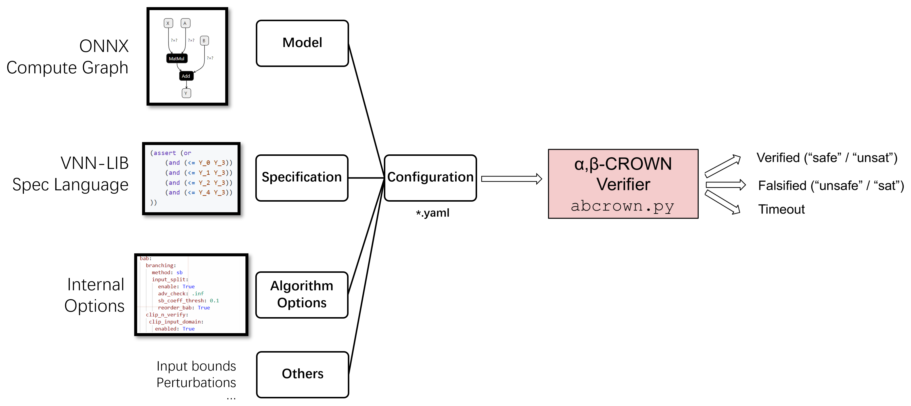
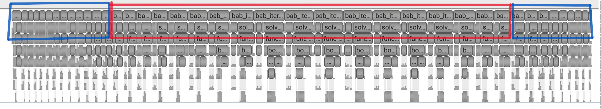
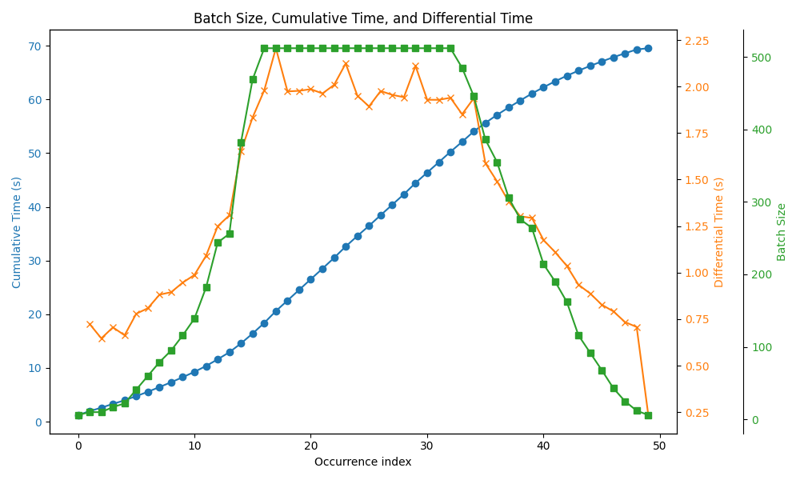

# A Guide to Study the Performance of alpha-beta-CROWN

After finishing this guide, you will become able to:

- Understand the representation of the problem that alpha-beta-CROWN solve.
- Reproduce two typical workloads in alpha-beta-CROWN.
- Observe the room for parallelization.


## Representation of Problem




The above figure shows a general workflow of what alpha-beta-CROWN takes and outputs. 

- **Model** refers to an ONNX file, which represents a neural network. Technically, neural network is just a compute graph, alpha-beta-CROWN can read and parse general compute graph and perform verification.
- **Specification** refers to a neural network verification problem which is often expressed in VNN-LIB format. 
- **Algorithm Options** refers to algorithm arguments and hyperparameters to control the exact behaviour of alpha-beta-CROWN. For example, the following workloads, Input_BaB and ReLU_BaB, are just two different set of algorithm options
- **Others** are other components that necessary to alpha-beta-CROWN. Sometimes part of them are absurbed by Specification.

Given the configuration, alpha-beta-CROWN will perform verification and output Verified/Falsified/Timeout. 

## Reproduce Typical Workloads

Branch and Bound (BaB) is the core framework that alpha-beta-CROWN relies on. Branch and Bound starts to try to verify the initial domains, which are directly translated from original specification. If the initial domain(s) remain unverified after an incomplete verification query, we split (branch) it into two (or more) sub-domains. If all sub-domains are verified, then the initial domain can be inferred as verified. Recursively, sub-domains can have their sub-sub-domains too. Based on the domain split(branch) algorithm, we have two typical workloads: Input_BaB and ReLU_BaB. 

In the following section, you will install alpha-beta-CROWN to reproduce two typical workloads: Input_BaB and ReLU_BaB. Notably, we relies on a CUDA device (e.g. GPU) to run the examples.

### I. Install of alpha-beta-CROWN


In this repo, alpha-beta-CROWN does not require explicit 'install'. After dependency is built, this software is ready to run. The following guide can be used on Linux only.

1. Concretize all Recursive Git Submodule

```sh
git clone --recursive https://github.com/Winlere/alpha-beta-CROWN-performance-study.git
# if you alreay cloned this repo without recursive, please type:
#  git submodule update --init --recursive
cd alpha-beta-CROWN-performance-study
```

2. Install Conda


You can safely skip this step if you have installed miniconda in your environment.

```sh
bash conda_install.sh
```

3. Install Dependencies

```sh

conda deactivate && conda env remove --name alpha-beta-crown # remove old version if needed
conda env create -f alpha-beta-CROWN-vnncomp2025/complete_verifier/environment_pyt260.yaml --name alpha-beta-crown
conda activate alpha-beta-crown
```

4. Sanity Test

```sh
bash sanity_check.sh
```

If you see the following output, your installation is fine.

```
Model prediction: -1.0
IBP bounds: lower=-6.0, upper=4.0
CROWN bounds: lower=-3.0, upper=3.0
CROWN linear (symbolic) bounds: lA x + lbias <= f(x) <= uA x + ubias, where
{'lA': tensor([[[-0.3333, -0.3333]]]), 'uA': tensor([[[-1.3333,  0.3333]]]), 'lbias': tensor([[-2.]]), 'ubias': tensor([[1.3333]]), 'unstable_idx': None}
Early stop at 12th iter due to 10 iterations no improvement!
Early stop at 11th iter due to 10 iterations no improvement!
alpha-CROWN bounds: lower=-3.0, upper=2.0
alpha-CROWN linear (symbolic) bounds: lA x + lbias <= f(x) <= uA x + ubias, where
{'lA': tensor([[[-0.3333, -0.3333]]]), 'uA': tensor([[[-0.1077, -0.2795]]]), 'lbias': tensor([[-2.]]), 'ubias': tensor([[1.3333]])}
```

5. Download Dataset

```
pushd vnncomp
bash setup.sh
popd
```

If you see something like this, your download succeeeded. 

```
   creating: large_models/vnncomp2024/vggnet16_2023/seed_896832480/onnx/
 extracting: large_models/vnncomp2024/vggnet16_2023/seed_896832480/onnx/vgg16-7.onnx.gz  
   creating: large_models/vnncomp2024/vggnet16_2023/seed_896832480/vnnlib/
   creating: large_models/vnncomp2024/vggnet16_2023/seed_933540974/
   creating: large_models/vnncomp2024/vggnet16_2023/seed_933540974/onnx/
 extracting: large_models/vnncomp2024/vggnet16_2023/seed_933540974/onnx/vgg16-7.onnx.gz  
   creating: large_models/vnncomp2024/vggnet16_2023/seed_933540974/vnnlib/
Moving large benchmark files
Unzipping
CREATING HARDCODED SYMLINKS FOR BROKEN BENCHMARKS
~/alpha-beta-CROWN-performance-study/vnncomp
~/alpha-beta-CROWN-performance-study
```

If there is no error, then you are all set.


### II. Reproduce Workload 1: Input_BaB on nn4sys

This will require a GPU and CUDA installed to execute.

**This is an easy example. However, currently, there are other instances that take 209504s (58 hours) to finish.** For testing purpose, here we only pick a small instance while sufficient to demonstrate the potential.

1. Run Input_BaB on nn4sys

```sh
cd alpha-beta-CROWN-vnncomp2025/complete_verifier
python abcrown.py --config ../../exp_configs/nn4sys.yaml  # yes, exactly the same
```


At first run, you might stuck here for some time before algorithm starts. This is a one-time cost for model and vnnlib compiling.

```
 %%%%%%%%%%%%%%%%%%%%%%%%%%%%%%%%%%% idx: 192, vnnlib ID: 192 %%%%%%%%%%%%%%%%%%%%%%%%%%%%%%%%%%%
Using onnx onnx/mscn_2048d_dual.onnx
Using vnnlib vnnlib/cardinality_1_10450_2048_dual.vnnlib
308 inputs and 1 outputs in vnnlib
```

After about 100 seconds, you will see:

```
...
Iteration 117
Current pickout batch: 2
Using Linf sparse perturbation. Perturbed dimensions: 3.
Avg perturbation: 0.007854422554373741
Worst bound: tensor([9.67226952e-05], device='cuda:0')
No domains left, verification finished!
Time: pickout 0.0003    init 0.0002    concretize 0.0002    bounding 0.0948    filtering 0.0002    decision 0.0007    split 0.0031    clip 0.0013    add_domain 0.0006    summary 0.0000    
Accumulated time: pickout 0.1342    bounding 71.0516    init 2.5453    concretize 2.5513    filtering 0.0465    decision 0.0429    split 0.1370    clip 0.1968    add_domain 0.2607    summary 0.0698    
Length of domains: 0
121390 domains visited
Cumulative time: 72.29097247123718

Result: safe in 90.0769 seconds
############# Summary #############
Final verified acc: 100.0% (total 1 examples)
Problem instances count: 1 , total verified (safe/unsat): 1 , total falsified (unsafe/sat): 0 , timeout: 0
mean time for ALL instances (total 1):90.07596944332374, max time: 90.07687020301819
mean time for verified SAFE instances(total 1): 90.07687020301819, max time: 90.07687020301819
safe (total 1), index: [192]
```

which shows a verification task using Input_BaB has finished, and the verification result is `safe`.

### III. Reproduce Workload 2: ReLU_BaB on cifar100


**This is an easy example. Currently, there are other ReLU_BaB instances still timeout in acceptable time, or take significantly higher time to finish.** For testing purpose, here we only pick a small instance while sufficient to demonstrate the potential.

1. Run ReLU_BaB on cifar100

```sh
cd alpha-beta-CROWN-vnncomp2025/complete_verifier
python abcrown.py --config ../../exp_configs/cifar_100.yaml
```

After about 100 seconds, you will see

```
...
BaB round 40
batch: 4
splitting decisions: 
split level 0: [/input-40, 822] [/input-8, 1633] [/input-8, 1633] [/input-8, 1633] 
split level 1: [/input-24, 6766] [/input-24, 6766] [/input-24, 6766] [/input-24, 6766] 

all verified at 0th iter
best_l after optimization: 0.36754655838012695
beta sum per layer: [0.0, 0.0, 0.0, 0.0, 0.0, 0.0, 0.0, 0.0, 0.0, 0.0]
alpha/beta optimization time: 0.019907712936401367
pruning_in_iteration open status: False
ratio of positive domain = 16 / 16 = 1.0
pruning-in-iteration extra time: 0.00010991096496582031
torch.Size([16, 1])
Time: prepare 0.0036    bound 0.0243    transfer 0.0019    finalize 0.0010    func 0.0308    
Accumulated time: func 37.4628    prepare 5.2010    bound 20.2275    transfer 5.7795    finalize 5.2396    
max lb tensor(0.04157829) min lb tensor(0.00821877)
Number of Verified Splits: 16 of 16
Length of domains: 0
No domains left, verification finished!
Current (lb-rhs): 1.0000000116860974e-07
14465 domains visited
Time: pickout 0.0041    decision 0.1289    set_bounds 0.0036    solve 0.0315    add 0.0001    
Accumulated time: pickout 2.8931    decision 17.9985    set_bounds 8.4228    solve 37.5938    add 2.8209    
Cumulative time: 71.91053891181946

Result: safe in 92.3200 seconds
############# Summary #############
Final verified acc: 100.0% (total 1 examples)
Problem instances count: 1 , total verified (safe/unsat): 1 , total falsified (unsafe/sat): 0 , timeout: 0
mean time for ALL instances (total 1):92.31906005334172, max time: 92.31998324394226
mean time for verified SAFE instances(total 1): 92.31998324394226, max time: 92.31998324394226
safe (total 1), index: [66]
```

which shows a verification task using ReLU_BaB has finished, and the verification result is `safe`.

## Understand Parallelization Potentials

In the following sections, we will introduce one parallel technique.

Recapping previous introduction, Branch and Bound (BaB) is the core framework that alpha-beta-CROWN relies on. Branch and Bound starts to try to verify the initial domains, which are directly translated from original specification. If the initial domain(s) remain unverified after an incomplete verification query, we split (branch) it into two (or more) sub-domains. If all sub-domains are verified, then the initial domain can be inferred as verified. Recursively, sub-domains can have their sub-sub-domains too. 

Like an iterative algorithm, starting from initial domain(s), after each iteration, unverified domains will be split into two (or more) domains. The underlying incomplete verifier can answer domain verification queries in batch.


### Domain Parallel



Above is a profile graph of a simple instance. Each block at the first row represents time interval of an iteration.

- At the **starting-up stage** (first stage) (blue region): The number of unverified domains is small but growing.
- At the **bottleneck stage** (second stage) (red region): The number of unverified domains is more than the maximum batch size or large enough to saturate the GPU device. **This stage visits the most domains and is the most time consuming stage. In the hard instance, this stage lasts for days.**
- At the **finishing-up stage** (third stage) (blue region): The number of unverified domains drops, and the BaB is close to the end.

Belows shows a small example of how batch size evolving with iterations, please notice that the x-axis is the iteration index and does not represent time directly.


<p align="center">

</p>

1. At the starting-up stage (0~15, fast iterations): The number of unverified domains grows, therefore the batch size of query grows.
2. At the bottleneck (16~34, bottleneck iterations): The number of unverified domains is large enough, constrained by GPU memory size, the batch size of query remain on a plateus. The total number of unverified domains peak at around 25 iterations (however, not reflected on the graph).
3. At the finishing-up stage (35~49, fast iterations): The number of unverified domains drops, therefore the batch size of query drops. When the number of unverified domains is zero, we can conclude the verification.

**This is a small example. Currently, there are instances that take 209504s (58 hours) to finish, and most of the time is spent on the bottleneck stage. In contrast the starting-up and finishing-up stage are just a few seconds.**

For the bottleneck stage, we can parallelize it by distributing the unverified domains into multiple GPUs/machines. This parallelization technique will speed up the bottleneck stage, and therefore reduce overall time significantly.
